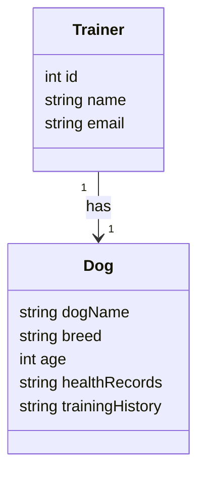

Santander Dev Week 2024
Java RESTful

## Diagrama de classe

```mermaid
classDiagram
    class Trainer {
        int id
        string name
        string email
    }

    class Dog {
        string dogName
        string breed
        int age
        string healthRecords
        string trainingHistory
    }

    Trainer "1" --> "1" Dog : has
```
